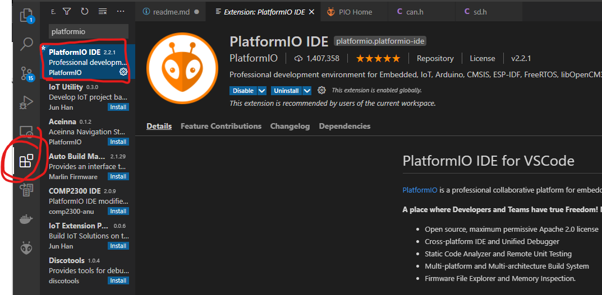
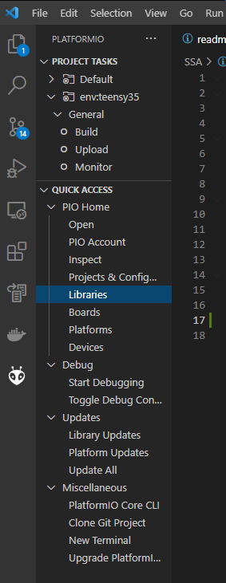

## Name: BFB
### Engineers: 
William Sun

## Description
The BFB controls two analog multiplexers that can read from 16 analog lines each.
The goal of the BFB is to read 26 analog voltages. These voltages correspond to a temperature
If any of the temperatures fall outside the operating range (0 degC to 60 degC), the teensy will output HIGH on pin 21 indicating a fault

The data sheets for the hardware components are as follows:
- 
- 
  - Table and graph of temperature vs voltage found on page 3

## Teensy Hardware Connections
Multiplexer 1:
A0 (Address Line 0) --> Pin 5
A1 (Address Line 1) --> Pin 6
A2 (Address  Line 2) --> Pin 7 
A3 (Address Line 3) --> Pin 8
EN (Enable pin) --> Pin 9
Output PIN --> Pin 14

Multiplexer 2:
A0 (Address Line 0) --> Pin 35
A1 (Address Line 1) --> Pin 36
A2 (Address  Line 2) --> Pin 37
A3 (Address Line 3) --> Pin 38
EN (Enable pin) --> Pin 30
Output PIN --> Pin 15

The 26 analog lines are connected to the multiplexers in order. 
Populates all 16 lines of mux1 and 10 lines of mux2. 
The last 6 lines of mux2 (S11-S16) are the ones that are not populated. 

## Getting Started:
This section was taken and modified from the SSA (as they both use a teensy 3.5)

1) Install Visual Studio Code
2) Install Platformio extension 
   1) click the extension icon on the left
   2) find platformio ide
   3) click install
   - 
3) Open the Platformio project 
   1) click the platformio icon on the left
   2) click open (under PIO home)
   3) click open project, and navigate to BFB root directory
   - 
4) Build with tick button in the bottom left 
   - 
5) Upload built hex to the Teensy by pressing the upload button in the bottom left. It looks like a right arrow
   - 

## Helpful Notes:
- To see the Serial.print output, click the Serial Monitor button at the bottom left
  - 
