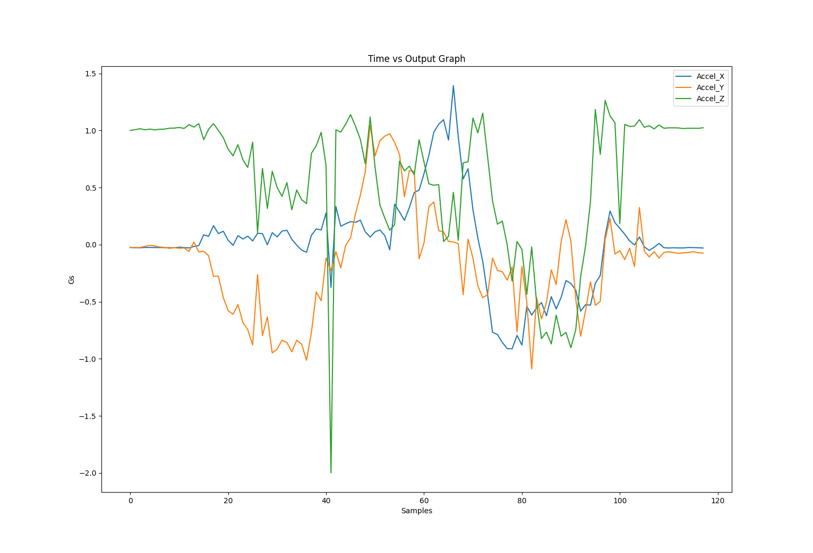

# Data Acquisition Script

## Description
The DAS is a script designed to interpret the raw data collected from the SSA. Currently, it is run on the python interpreter using various arguments to change the behavior of the program

### Dependencies
Libraries: see requirements.txt
```
pip3 install -r requirements.txt
```
Note: depending on your OS, the command might be "pip" or "pip3"

## Web Interface usage
run this command to get a local instance of the server running
```
python3 app.py
```
Note: depending on your OS, the command might be "python" or "python3"

You should see the following ouput in your terminal:


Click on the link on the last line to open the web app on your preferred browser

### Troubleshooting Web App

If you notice that even after adding changes that should affect the visiualization scheme of the web app
(for example making changes in HTML/CSS/JS files) but the app is not showing these changes, you may have to
empty the cache in your browser. On Chrome, this can be done with the command: Ctrl+Shift+R

*For more information regarding the DAS Web App, you can check out the design report [here](https://docs.google.com/document/d/1O5GnRuEjnTY7DEAOL7dBxdqCURFXkMkzjQ2eLScyRwQ/edit)

## Commmand Line Interface Usage

### Command line argument layout:
```
python3 das.py --csv <file> --sensor <SENSOR> --function <FUNCTION> --view <VIEW>
```

Example of command line argument:

### Read in Accelerometer data and plot the relative minimums over the raw data
```
python3 das.py --csv data_1.csv --sensor accel --function relmin --view standard
```

### Read in IR temperature data and plot the raw values
```
python3 das.py --csv data_1.csv --sensor temp --function raw --view standard
```

## Example of raw data visualization for the accelerometer

