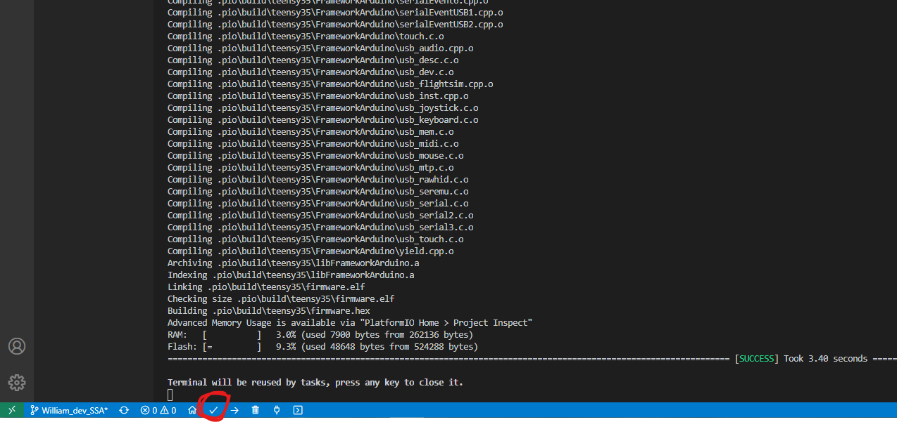
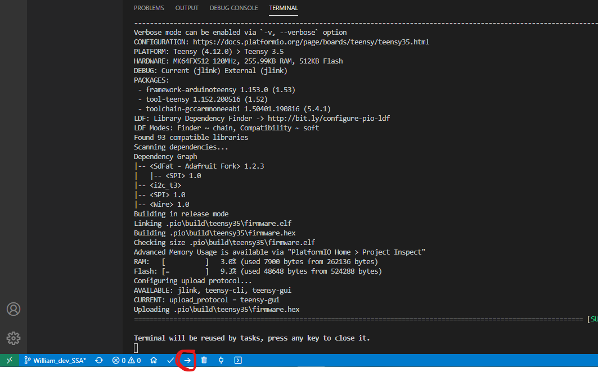
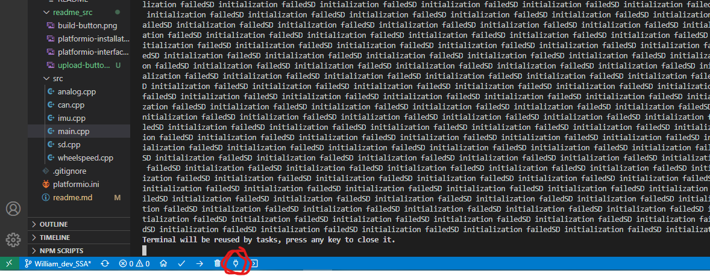

## Name: Suspension Sensor Array
### Engineers: 
Andrew Kettle, Jada Berenguer, Leslie Uribe, and Micheal Barbosa

## Description:
- Data acquisition module for Ampeater v1. Integrates 3 IR sensors, 1 IMU, and a hall effect sensor.
- IR sensors are used for reading tire temperatures. The tire is measured at three different points; the inside, middle, and outside. 
- The IMU is used to measure acceleration and gyro data. 
- The hall effect sensor is used with 2 magnets to estimate tire speed. 

## Getting Started:
1) Install Visual Studio Code
2) Install Platformio extension 
   1) click the extension icon on the left
   2) find platformio ide
   3) click install
   - 
3) Open the Platformio project 
   1) click the platformio icon on the left
   2) click open (under PIO home)
   3) click open project, and navigate to SSA root directory
   4) Platformio should install the necessary dependencies for you
   - 
4) Recursively clone git submodules
   1) We are using a library called FlexCAN that is not in Platformio
   2) Luckily it is open-source, so we are including the git repo for the FlexCAN library in the lib directory using a git feature called submodules
   3) When cloning a repository, it doesnt automatically clone the submodules of the repo. In order to do this, go to the root directory of the repository and run this command
      - git submodule update --init
5) Build with tick button in the bottom left 
   - 
6) Upload built hex to the Teensy by pressing the upload button in the bottom left. It looks like a right arrow
   - 

## Helpful Notes:
- To see the Serial.print output, click the Serial Monitor button at the bottom left
  - 
- If you can't write to the SD card, note that the SD card needs to be formatted as a FAT
  - look up how to format disks. On MacOS, DiskUtility can be used